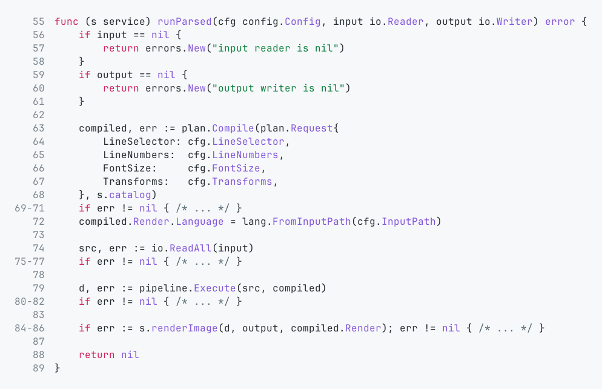
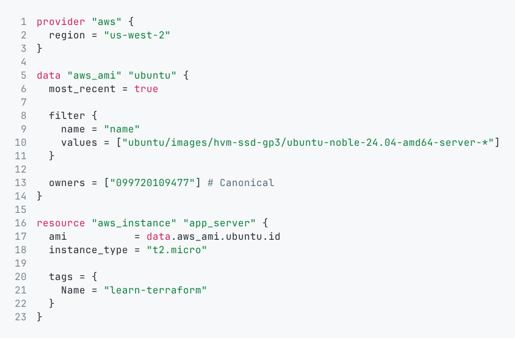

# gophershot

Render source code into a PNG image.

## Build

Build the binary:

```bash
go build -o bin/gophershot ./cmd/gophershot
```

## Run

Using the built binary:

```bash
./bin/gophershot --out example/go-example.png internal/app/run.go
```

`runParsed` section example (lines `55:89`, no transforms):

```bash
./bin/gophershot --out example/go-example.png --transform= --lines 55:89 internal/app/run.go
```

Terraform file:

```bash
./bin/gophershot --out example/tf-example.png example/main.tf
```

From stdin:

```bash
cat internal/app/run.go | ./bin/gophershot --out example/go-example.png
```

## Example output

Go example:



Terraform example:



## Common options

```bash
./bin/gophershot \
  --out example/go-example.png \
  --transform stripimports,errcompact \
  --lines 15:40,44,48:52 \
  --line-numbers=true \
  --font-size 16 \
  internal/app/run.go
```

## Flags

- `--out <path>`: output PNG path (required)
- `--lines <selector>`: comma-separated segments, each segment is a line (`7`) or range (`5:9`); if repeated, the last value is used
- `--transform <names>`: comma-separated names, applied in order; if repeated, the last value is used; when omitted defaults are language-aware (`stripimports,errcompact` for Go/stdin, none for `.tf`)
- `--line-numbers[=true|false]`: show line numbers (default: `true`)
- `--font-size <float>`: code font size in points, must be `> 0` (default: `16`)
- `-h`, `--help`: show help

## Built-in transforms

- `stripimports`: removes `import` declarations
- `errcompact`: compacts `if err != nil { ... }` blocks into a single placeholder line

## Notes

- Transforms run on the full file first.
- Line selection is applied after transforms, using original source line origins.
- Built-in transforms are Go-oriented; when input is `.tf`, omitted `--transform` defaults to no transforms.
- Flags must be provided before the input path.

## Development

Run tests:

```bash
go test ./...
```

## Licensing

- Project license: see repository license file.
- Third-party notices: `THIRD_PARTY_NOTICES.md`
- JetBrains Mono OFL text: `third_party/jetbrainsmono/OFL.txt`
