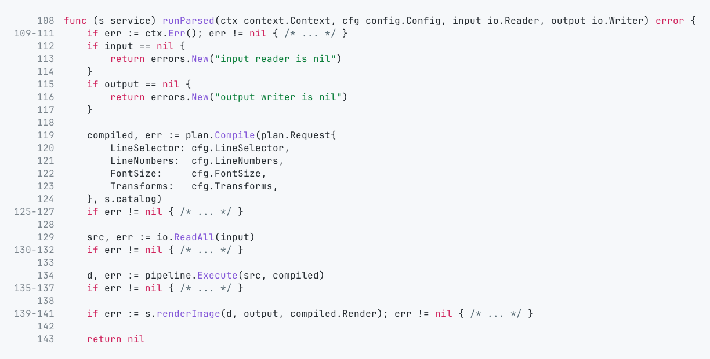

# gophershot

Render Go source code into a PNG image.

## Build

Build the binary:

```bash
go build -o bin/gophershot ./cmd/gophershot
```

## Run

Using the built binary:

```bash
./bin/gophershot internal/app/run.go --out example.png
```

From stdin:

```bash
cat internal/app/run.go | ./bin/gophershot --out example.png
```

## Example output



## Common options

```bash
./bin/gophershot \
  internal/app/run.go \
  --out example.png \
  --transform stripimports \
  --transform errcompact \
  --lines 107:143 \
  --line-numbers=true \
  --font-size 16
```

## Flags

- `--out <path>`: output PNG path (required)
- `--lines <selector>`: either range (`start:end`) or list (`1,2,5`)
- `--transform <name>`: repeatable, applied in the order provided
- `--line-numbers[=true|false]`: show line numbers (default: `true`)
- `--font-size <float>`: code font size in points, must be `> 0` (default: `16`)
- `-h`, `--help`: show help

## Built-in transforms

- `stripimports`: removes `import` declarations
- `errcompact`: compacts `if err != nil { ... }` blocks into a single placeholder line

## Notes

- Transforms run on the full file first.
- Line selection is applied after transforms, using original source line origins.

## Development

Run tests:

```bash
go test ./...
```

## Licensing

- Project license: see repository license file.
- Third-party notices: `THIRD_PARTY_NOTICES.md`
- JetBrains Mono OFL text: `third_party/jetbrainsmono/OFL.txt`
